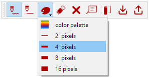
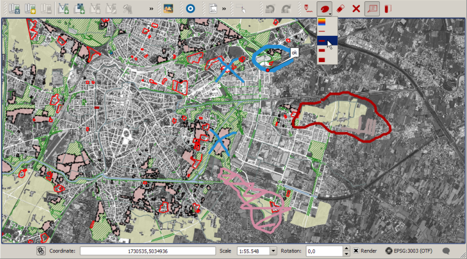

# Red Layer plugin

A QGIS3 plugin for raw sketching and drawing on map canvas. It is intended for quick annotations and field use. Sketches can be drawn in different colors and widths over the map canvas, without mixing with existing layers but can be converted in memory layer if needed. The sketches are stored in the project directory in a separate .sketch txt file that can be shared with other users.

On plugin install or with new unsaved project the toolbar is disabled:

When the project is saved the toolbar gets enabled

and is possible to sketch on the screen

Tutorial on [Youtube](https://youtu.be/zLt9LB-_8rs)
